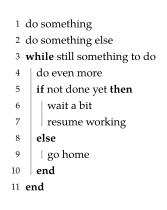

# Lovelace
This is a package for writing pseudocode in [Typst](https://typst.app/).
It is named after the computer science pioneer
[Ada Lovelace](https://en.wikipedia.org/wiki/Ada_Lovelace) and inspired by the
[pseudo package](https://ctan.org/pkg/pseudo) for LaTeX.

[](https://a5s.eu/toot-lovelace/)


Pseudocode is not a programming language, it doesn't have strict syntax, so
you should be able to write it however you need to in your specific situation.
Lovelace lets you do exactly that.

Main features include:
- arbitrary keywords and syntax structures
- optional line numbering
- line labels
- lots of customisation with sensible defaults


## Usage

- [Getting started](#getting-started)
- [Lower level interface](#lower-level-interface)
- [Line numbers](#line-numbers)
- [Referencing lines](#referencing-lines)
- [Indentation guides](#indentation-guides)
- [Spacing](#spacing)
- [Decorations](#decorations)
- [Algorithm as figure](#algorithm-as-figure)
- [Customisation overview](#customisation-overview)
- [Exported functions](#exported-functions)

### Getting started

Import the package using
```typ
#import "@preview/lovelace:0.3.0": *
```

The simplest usage is via `pseudocode-list` which transforms a nested list
into pseudocode:
```typ
#pseudocode-list[
  + do something
  + do something else
  + *while* still something to do
    + do even more
    + *if* not done yet *then*
      + wait a bit
      + resume working
    + *else*
      + go home
    + *end*
  + *end*
]
```
resulting in:

<picture>
  <source media="(prefers-color-scheme: dark)" srcset="examples/simple-dark.svg">
  <source media="(prefers-color-scheme: light)" srcset="examples/simple-light.svg">
  
</picture>

As you can see, every list item becomes one line of code and nested lists become
indented blocks.
There are no special commands for common keywords and control structures, you
just use whatever you like.

**To learn more about how to use and customize Lovelace,
[visit the tutorial](https://a5s.eu/toot-lovelace/).**


### Exported functions

